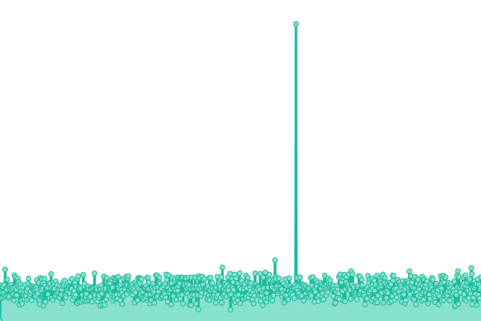
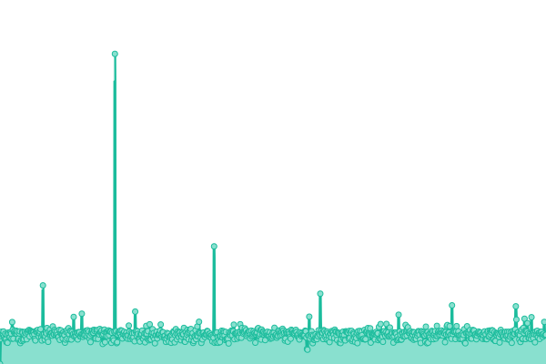
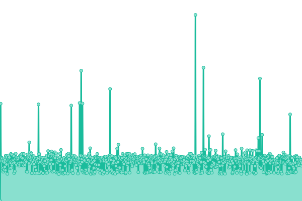
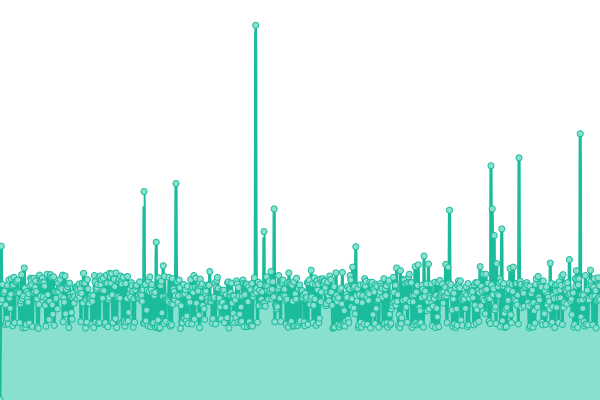

# [📈 Live Status](https://status.nueip.com): <!--live status--> **🟩 All systems operational**

This repository contains the open-source uptime monitor and status page for [NUEiP](https://status.nueip.com), powered by [Upptime](https://github.com/upptime/upptime).

With [Upptime](https://upptime.js.org), you can get your own unlimited and free uptime monitor and status page, powered entirely by a GitHub repository. We use [Issues](https://github.com/nueip/upptime/issues) as incident reports, [Actions](https://github.com/nueip/upptime/actions) as uptime monitors, and [Pages](https://status.nueip.com) for the status page.

<!--start: status pages-->
<!-- This summary is generated by Upptime (https://github.com/upptime/upptime) -->
<!-- Do not edit this manually, your changes will be overwritten -->
<!-- prettier-ignore -->
| URL | Status | History | Response Time | Uptime |
| --- | ------ | ------- | ------------- | ------ |
|  [NUEiP Official website](https://www.nueip.com) | 🟩 Up | [nu-ei-p-official-website.yml](https://github.com/nueip/upptime/commits/HEAD/history/nu-ei-p-official-website.yml) | 

 379ms
     
 | 

<a href="https://status.nueip.com/history/nu-ei-p-official-website">100.00%</a>
    

|  [NUEiP HRM](https://cloud.nueip.com) | 🟩 Up | [nu-ei-p-hrm.yml](https://github.com/nueip/upptime/commits/HEAD/history/nu-ei-p-hrm.yml) | 

 292ms
     
 | 

<a href="https://status.nueip.com/history/nu-ei-p-hrm">100.00%</a>
    

|  [NUEiP CRM](https://crm.nueip.com) | 🟩 Up | [nu-ei-p-crm.yml](https://github.com/nueip/upptime/commits/HEAD/history/nu-ei-p-crm.yml) | 

 242ms
     
 | 

<a href="https://status.nueip.com/history/nu-ei-p-crm">100.00%</a>
    

|  [NUEiP Bi](https://bi.nueip.com) | 🟩 Up | [nu-ei-p-bi.yml](https://github.com/nueip/upptime/commits/HEAD/history/nu-ei-p-bi.yml) | 

 237ms
     
 | 

<a href="https://status.nueip.com/history/nu-ei-p-bi">100.00%</a>
    

<!--end: status pages-->

[**Visit our status website →**](https://status.nueip.com)

## 📄 License

- Powered by: [Upptime](https://github.com/upptime/upptime)
- Code: [MIT](./LICENSE) © [NUEiP](https://status.nueip.com)
- Data in the `./history` directory: [Open Database License](https://opendatacommons.org/licenses/odbl/1-0/)
